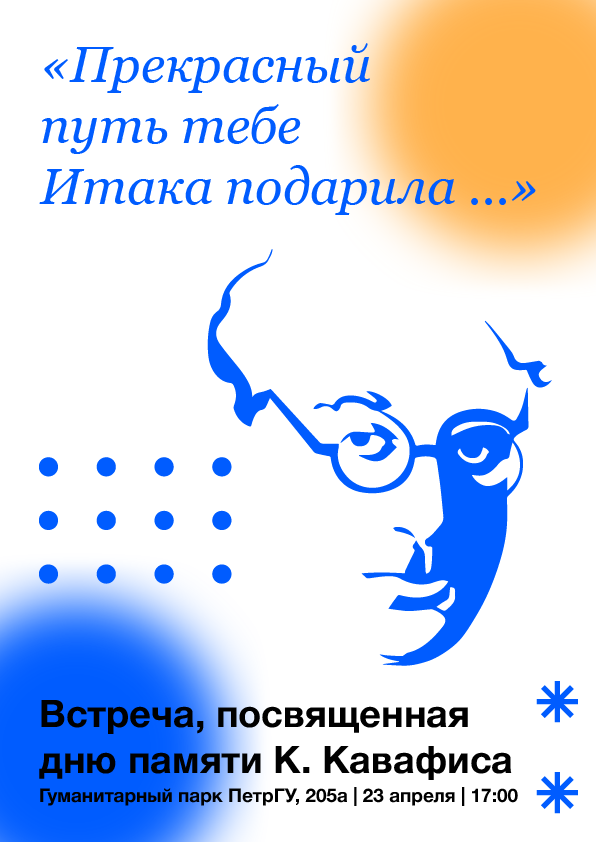

**29 апреля отмечается 160 лет со дня рождения реформатора и основоположника современной греческой литературы Константиноса Кавафиса и 90 лет со дня его смерти.**

Накануне состоялся вечер памяти поэта, на котором прозвучали стихотворения «Город», «Стены», «Итака», «Троянцы», «Свечи», «Голоса», «По мере сил», «Бог покидает Антония» и другие на греческом языке и в переводах Г. Шмакова, И. Бродского, С. Ильинской и Ю. Мориц.

<!--truncate-->

Своими любимыми лирическими текстами Кавафиса поделились преподаватели кафедры классической филологии, русской литературы и журналистики Института филологии Петрозаводского государственного университета Елена Владимировна Каурова и Евгения Петровна Литинская, студенты-классики Елизавета Ивлева, Арина Абрамова, Александра Козырева, Юлия Калинина, Мария Мартемьянова и Тата Черемовская, греки, которые сейчас живут в России, публицист, преподаватель школы греческого языка «Эллиника» Екатерина Аравани, Илья Милтых, представитель сообщества OMOGENIS.RU и другие члены сообщества.

Чтение стихотворений сопровождалось комментариями и личными впечатлениями выступающих. Лейтмотивом звучала мысль о том, что как бы ни были удачны переводы, далеко не во всех случаях они передают смысл, интонацию оригинала в полном объеме.

Мероприятие организовано кафедрой классической филологии, русской литературы и журналистики Института филологии Петрозаводского государственного университета при поддержке сообщества OMOGENIS.RU.