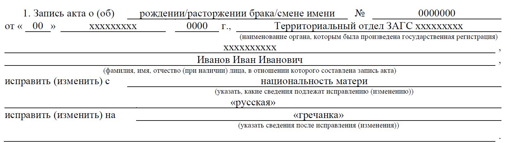
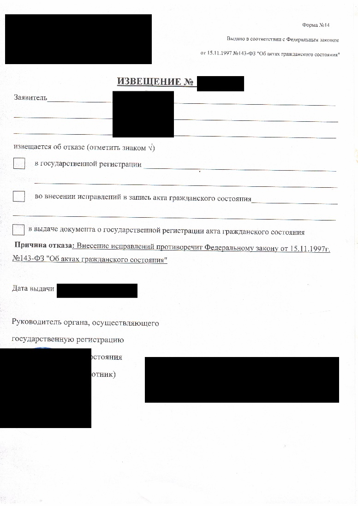

# Процедура изменения национальности в документах российского ЗАГС

**ДИСКЛЕЙМЕР: прежде всего важно бы отметить, я не юрист. Я лишь описываю
свой опыт внесения изменений в документы ЗАГС. К сожалению, я не в силах
гарантировать, что все пройдет также, как будет здесь описано.**

## Досудебный этап

Прежде всего нужно определиться, в какие документы Вам необходимо внести
изменения. Здесь важно отметить, если у Вас есть дети и Вы в разводе --
для внесения изменения в свидетельство о рождении (СОР)
несовершеннолетнего ребенка Вам **понадобится согласие второго
родителя**. **Без этого, к сожалению, ничего не выйдет.** Также,
если Вы (или Ваши родители в разводе, но Вы рождены в браке), Вам
понадобится «СПРАВКА О ЗАКЛЮЧЕНИИ БРАКА» (Форма №6). Получите ее
заранее! Если Вы внесете изменения в свидетельство о расторжении брака,
**данные в этой справке автоматически не поменяются**, для этого
придется заплатить сверху 650 рублей за внесение изменений по форме 23
(и есть вероятность, что придется делать это через суд).

Через данную процедуру я проходил два раза: сначала моя мама вносила
изменения в СОР в графу «национальность» своего отца, затем я менял
«национальность» матери в СОР на основании записи о национальности моего
дедушки. С ЗАГСом лучше быть в хороших отношениях, они в данном вопросе
вам очень помогут!

### Шаг 1. Подача заявления в ЗАГС.

Для подачи такого заявления нужно оплатить гос.пошлину в размере 650
рублей по реквизитам Вашего отделения ЗАГС. Далее заполняете [форму
№23](https://hendn2f-my.sharepoint.com/:w:/g/personal/m25233_wevip365_com/EaCn8xD-XhNBuivs-8-AQ44B2GvvktzUHl5esV8ucU3RwA?e=LO2HrN).
Каждый совершеннолетний заявитель заполняет отдельную форму (и платит
гос.пошлину).

Для примера:

После чего Вы получаете извещение об отказе:

Данное извещение -- Ваше основание для обращения в суд.

*Альтернативный вариант:*

Если Ваш ЗАГС разрешит так сделать, то Вы в свободной форме подаете
заявление об изменении записи акта гражданского состояния. В таком
случае гос.пошлину платить не нужно.

<iframe width="100%" height="800" src="../../static/prepare-documents/application-to-ZAGS.pdf"></iframe>

В ответ получаете письмо на официальном бланке. Это и будет Ваше
основание для обращения в суд.

### Шаг 2. Подготовка искового заявления.

Определитесь, к какому суду относится Ваше отделение ЗАГС. Готовьте
документы в этот суд. В соответствии с пунктом 1 статьи 26 Конституции
Российской Федерации «Каждый вправе определять и указывать свою
национальную принадлежность. Никто не может быть принужден к определению
и указанию своей национальной принадлежности».

Примерный текст искового заявления:
<iframe width="100%" height="800" src="../../static/prepare-documents/Court-application.pdf"></iframe>

[Скачать в формате Word](../../static/prepare-documents/Court-application.docx)

Оплатите гос.пошлину в размере 300 рублей и приложите квитанцию к
комплекту документов. Распечатываете исковое заявление в двух (при
электронной подаче) или в трех (при очной) и подписываете. Один комплект
документов отправляете заказным письмом с описью в ЗАГС, второй --
подаете через сайт суда либо очно. Если подаете очно, попросите
секретаря суда оставить отметку о принятии документов на Вашем
экземпляре. Ожидайте приглашения на беседу.

## Судебный этап

### Шаг 3. Беседа и заседание суда.

Спустя какое-то время Вас пригласят на беседу с судом. Суд ознакомится с
Вашими исковыми требованиями и назначит дату заседания. Если Вы меняете
национальность одного из родителей в свидетельстве о рождении,
пригласите их вместе с Вами на заседание. Это существенно ускорит
процесс. Вам нужно лишь заявить устное ходатайство о приглашении
свидетеля: «Прошу пригласить в качестве свидетеля Иванову Инессу
Ивановну, которая находится в комнате ожидания». Суд спросит Вас, почему
Вы хотите внести данные изменения? Расскажите об истории своей семьи; о
политических репрессиях против греческого населения; геноциде греков,
упомяните о греческих традициях, которые вы соблюдаете; блюдах греческой
кухни, которые готовите. Меня спросили, говорим ли мы дома на греческом
языке, на что я ответил, что нет, но греческий язык знаем.

После решения суда проходит около месяца, после чего оно вступает в
силу.

## Послесудебный этап

### Шаг 4. Получение документов в ЗАГСе.

После вступления решения суда в законную силу, получите его в суде и
направляйтесь в ЗАГС. Там Вы получите документы с внесенными
изменениями. Обязательно проверьте, все ли верно!

### Шаг 5. Апостилирование

На документы, выданные территориальными органами ЗАГС, «Апостиль» ставит
Архив ЗАГСа. На сайте ЗАГСа Вашего региона можете узнать его адрес.
Привозите туда оригиналы всех новых свидетельств. Для подачи документов
и оплаты гос.пошлины, которая составляет 2 500 руб, требуется паспорт.
Обычно ЗАГС ставит Апостиль в течение 3--5 рабочих дней. После этого
можете сканировать документы и отправлять их переводчику в Грецию.

## Выводы

В целом, процедура внесения изменений в графе «национальность» на
документах ЗАГС не столько сложная, сколько муторная. Вполне можно
справиться самостоятельно без помощи адвоката. У меня данная процедура
заняла для двоих людей заняла около года. Стоимость на одного человека:
650 руб. (гос.пошлина при подаче заявления по форме №23) + 300 руб.
(гос.пошлина в суд) + 2 500\*n (апостилирование в зависимости от
количества документов).

Если у Вас возникнут какие-то дополнительные вопросы, напишите в чат, я
постараюсь ответить в силу моих возможностей.

