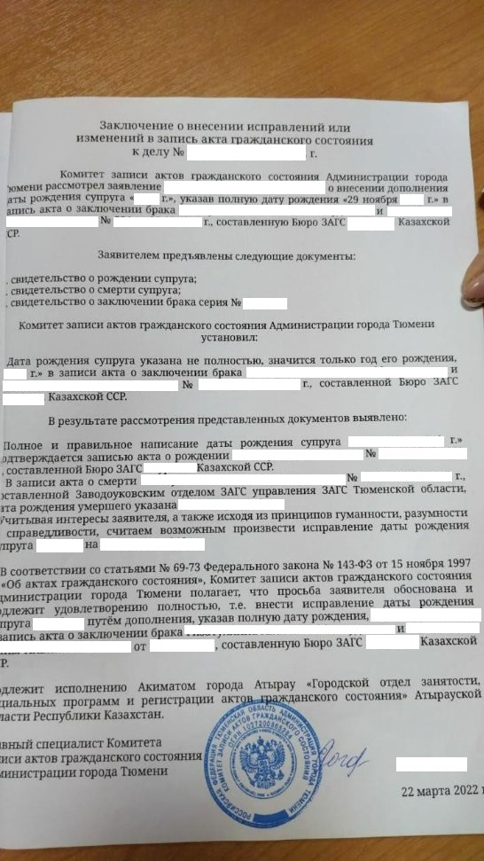
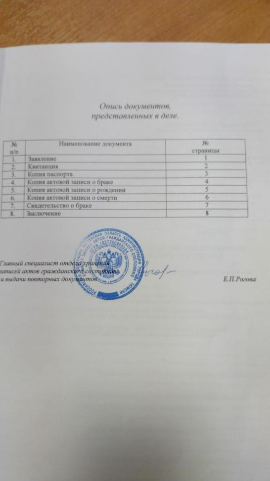
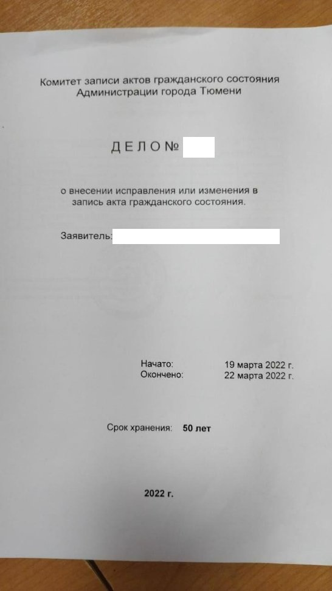

# Алгоритм действий по исправлению ошибки в фамилии в свидетельстве о рождении (на примере Республики Казахстан)

*Телеграмм канал Елена, [27.08.2022 17:00]* 

Делюсь алгоритмом действий по исправлению ошибки в фамилии в свидетельстве о рождении. В нашей ситуации страна создания и исправления ошибки -Казахстан. ЗАГСом, к которому по прописке относится владелец фамилии направляется запрос в ЗАГС, в актовой записи которого содержится ошибка, запрос об истребовании копии актовой записи с ошибкой (лучше направить запрос конечно самостоятельно, чтобы ускорить процесс). После получения копии актовой записи, ЗАГС формирует дело и направляет его в ЗАГС, который хранит актовую запись с ошибкой, на основании этого дела, актовая запись исправляется и выдаётся новое свидетельство о рождении с фамилией без ошибки.

## Образец дела 

Дело рандомное, прислали из ЗАГСа Казахстана как пример 

Да и ещё - копию актовой записи третьему лицу не выдают даже на основании доверенности. Только по запросу из ЗАГСа или непосредственно заинтересованному лицу 

