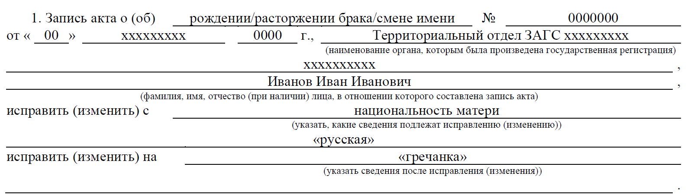
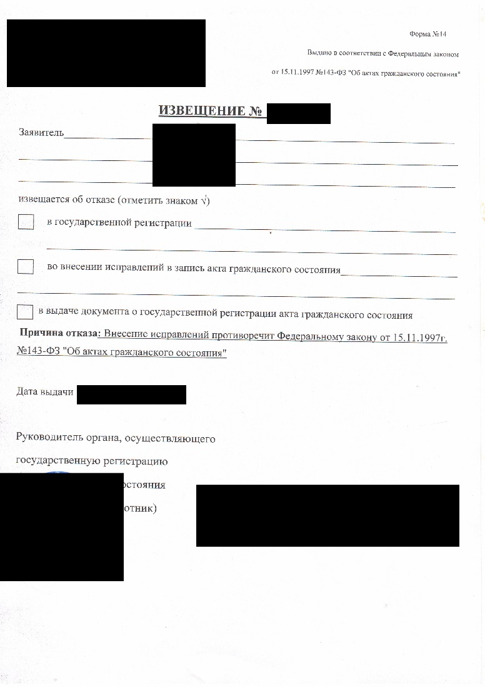

# Процедура изменения национальности в документах российского ЗАГС

**ДИСКЛЕЙМЕР: прежде всего важно бы отметить, я не юрист. Я лишь описываю
свой опыт внесения изменений в документы ЗАГС. К сожалению, я не в силах
гарантировать, что все пройдет также, как будет здесь описано.**

## Досудебный этап

Прежде всего нужно определиться, в какие документы Вам необходимо внести
изменения. Здесь важно отметить, если у Вас есть дети и Вы в разводе --
для внесения изменения в свидетельство о рождении (СОР)
несовершеннолетнего ребенка Вам **понадобится согласие второго
родителя**. **Без этого, к сожалению, ничего не выйдет.** Также,
если Вы (или Ваши родители в разводе, но Вы рождены в браке), Вам
понадобится «СПРАВКА О ЗАКЛЮЧЕНИИ БРАКА» (Форма №6). Получите ее
заранее! Если Вы внесете изменения в свидетельство о расторжении брака,
**данные в этой справке автоматически не поменяются**, для этого
придется заплатить сверху 650 рублей за внесение изменений по форме 23
(и есть вероятность, что придется делать это через суд).

Через данную процедуру я проходил два раза: сначала моя мама вносила
изменения в СОР в графу «национальность» своего отца, затем я менял
«национальность» матери в СОР на основании записи о национальности моего
дедушки. С ЗАГСом лучше быть в хороших отношениях, они в данном вопросе
вам очень помогут!

### Шаг 1. Подача заявления в ЗАГС.

Для подачи такого заявления нужно оплатить гос.пошлину в размере 650
рублей по реквизитам Вашего отделения ЗАГС. Далее заполняете [форму
№23](https://hendn2f-my.sharepoint.com/:w:/g/personal/m25233_wevip365_com/EaCn8xD-XhNBuivs-8-AQ44B2GvvktzUHl5esV8ucU3RwA?e=LO2HrN).
Каждый совершеннолетний заявитель заполняет отдельную форму (и платит
гос.пошлину).

Для примера:

После чего Вы получаете извещение об отказе:

Данное извещение -- Ваше основание для обращения в суд.

*Альтернативный вариант:*

Если Ваш ЗАГС разрешит так сделать, то Вы в свободной форме подаете
заявление об изменении записи акта гражданского состояния. В таком
случае гос.пошлину платить не нужно.

<!-- <object data="../../static/prepare-documents/application-to-ZAGS.pdf" type="application/pdf" width="700px" height="700px">
    <embed src="../../static/prepare-documents/application-to-ZAGS.pdf">
        
This browser does not support PDFs. Please download the PDF to view it: <a href="../../static/prepare-documents/application-to-ZAGS.pdf">Download PDF</a>.

    </embed>
</object> -->
<iframe width="100%" height="800" src="../../static/prepare-documents/decline-desigion.jpeg"></iframe>

В ответ получаете письмо на официальном бланке. Это и будет Ваше
основание для обращения в суд.

### Шаг 2. Подготовка искового заявления.

Определитесь, к какому суду относится Ваше отделение ЗАГС. Готовьте
документы в этот суд. В соответствии с пунктом 1 статьи 26 Конституции
Российской Федерации «Каждый вправе определять и указывать свою
национальную принадлежность. Никто не может быть принужден к определению
и указанию своей национальной принадлежности».

Примерный текст искового заявления:

+----------------------------------------------------------------------+
| +--                                                                  |
| --------------------+----------------------------------------------+ |
| |                                                                    |
|                     | **ХХХХ районный суд**                        | |
| +==                                                                  |
| ====================+==============================================+ |
| |                                                                    |
|                     | *Адрес: 000000, ххххххх*                     | |
| +--                                                                  |
| --------------------+----------------------------------------------+ |
| | *                                                                  |
| *Заявитель:**       | **Иванов Иван Иванович**                     | |
| +--                                                                  |
| --------------------+----------------------------------------------+ |
| |                                                                    |
|                     | *Адрес: ххххххх*                             | |
| |                                                                    |
|                     |                                              | |
| |                                                                    |
|                     | *Тел.: +7 (999) --999 -- 99 - 99*            | |
| +--                                                                  |
| --------------------+----------------------------------------------+ |
| | *                                                                  |
| *Заинтересованное** | **Территориальный отдел ЗАГС хххххх района** | |
| |                                                                    |
|                     |                                              | |
| | *                                                                  |
| *лицо:**            |                                              | |
| +--                                                                  |
| --------------------+----------------------------------------------+ |
| |                                                                    |
|                     | *Адрес: 000000, ххххххх*                     | |
| +--                                                                  |
| --------------------+----------------------------------------------+ |
|                                                                      |
| ***Гос.пошлина 300 руб.***                                           |
|                                                                      |
| **ЗАЯВЛЕНИЕ**                                                        |
|                                                                      |
| ***об изменении записей актов гражданского состояния***              |
|                                                                      |
| На основании Конституции РФ ст.26 п.1, а также руководствуясь ст.ст. |
| 307, 308, 309 Гражданского процессуального кодекса РФ, прошу внести  |
| изменения в следующие записи актов:                                  |
|                                                                      |
| -   В актовую запись о рождении №00 от 00 хххх 0000 года,            |
|     составленную на Иванова Ивана Ивановича, исправление             |
|     национальности матери с «русская» на «гречанка»;                 |
|                                                                      |
| -   В актовую запись о перемене имени №0000000 от 00 хххх 0000 года, |
|     на Иванова Ивана Ивановича, дополнить национальность меняющего   |
|     «грек».                                                          |
|                                                                      |
| В соответствии с п. 1 ст. 73 Федерального закона «Об актах           |
| гражданского состояния» внесение исправления или изменения в запись  |
| акта гражданского состояния производится органом записи актов        |
| гражданского состояния по месту хранения записи, подлежащей          |
| исправлению или изменению.                                           |
|                                                                      |
| В соответствии с п. 2 ст. 73 Федерального закона «Об актах           |
| гражданского состояния» на основании исправленной или измененной     |
| записи акта гражданского состояния заявителю выдается новое          |
| свидетельство о государственной регистрации акта гражданского        |
| состояния.                                                           |
|                                                                      |
| Во внесудебном порядке внести соответствующие изменения мне не       |
| удалось. Во внесении исправлений мне было отказано по причине        |
| отсутствия оснований для внесения изменений национальности, ст. 69   |
| ФЗ РФ «Об актах гражданского состояния» от 15.11.1997г. №143-ФЗ и    |
| рекомендовано обратиться в суд в порядке ст. 307 ГПК РФ. В           |
| соответствии с п. 1 ст. 307 Гражданского процессуального кодекса     |
| Российской Федерации суд рассматривает дела о внесении исправлений   |
| или изменений в записи актов гражданского состояния, если органы     |
| записи актов гражданского состояния при отсутствии спора о праве     |
| отказались внести исправления или изменения в произведенные записи.  |
|                                                                      |
| Текущая запись в актах гражданского состояния, в графе               |
| «национальность» не соответствует действительности. По               |
| национальности я считаю себя греком. Моя мать -- Иванова И.И. --     |
| является гречанкой, о чем свидетельствует записи в графе             |
| национальность в свидетельстве о расторжении брака, в свидетельстве  |
| о перемене имени. Мой дедушка по материнской линии -- Иванов П.И. -- |
| является греком, о чем свидетельствует запись в графе национальность |
| отца в свидетельстве о рождении моей матери. Мой прадедушка по       |
| материнской линии -- Иванов И.И. -- является греком, о чем           |
| свидетельствует запись в графе национальность отца в свидетельстве о |
| рождении моего дедушки.                                              |
|                                                                      |
| Внесение изменений в вышеуказанную запись акта гражданского          |
| состояния мне необходимо для сохранения и документального            |
| подтверждения моей принадлежности к греческой нации.                 |
|                                                                      |
| На основании вышеизложенного и в соответствии с пп.3 п.1 ст. 47      |
| Гражданского кодекса РФ, ст. ст. 22, 23, 69, 70, 73 Федерального     |
| закона «Об актах гражданского состояния», пп. 9 п. 1 ст. 262, ст.    |
| ст. 263, 307, 308, 309 Гражданского процессуального кодекса РФ, а    |
| так же ст. 26, п.1 Конституции РФ.                                   |
|                                                                      |
| ПРОШУ:                                                               |
|                                                                      |
| 1.  Внести изменения в запись акта о рождении №00 от 00 хххх 0000    |
|     года, составленную отделом ЗАГС хххххххх на Иванова Ивана        |
|     Ивановича: исправить национальность матери с «русская» на        |
|     «гречанка»;                                                      |
|                                                                      |
| 2.  Внести изменения в запись акта о перемене имени №0000000 от 00   |
|     хххх 0000 года, составленную ХХХХХХХХХХ Управления ЗАГС:         |
|     дополнить национальность меняющего «грек».                       |
|                                                                      |
| ***Приложение:***                                                    |
|                                                                      |
| 1.  ***Квитанция с описью о направление сторонам копии заявления***  |
|                                                                      |
| 2.  ***Извещение № 00/0000000 Территориального отдела ЗАГС           |
|     Управления ЗАГС хххххх области***                                |
|                                                                      |
| 3.  ***\*Копии всех документов, на которые вы ссылаетесь +           |
|     Свидетельства, в которых нужно внести исправления\****           |
|                                                                      |
| 4.  ***Документы, подтверждающие оплату гос.пошлины***               |
|                                                                      |
| **Заявитель: \_\_\_\_\_\_\_\_\_\_\_\_\_\_\_\_ / Иванов И.И. /        |
| «00» ххххх 2022 г.**                                                 |
+----------------------------------------------------------------------+

Оплатите гос.пошлину в размере 300 рублей и приложите квитанцию к
комплекту документов. Распечатываете исковое заявление в двух (при
электронной подаче) или в трех (при очной) и подписываете. Один комплект
документов отправляете заказным письмом с описью в ЗАГС, второй --
подаете через сайт суда либо очно. Если подаете очно, попросите
секретаря суда оставить отметку о принятии документов на Вашем
экземпляре. Ожидайте приглашения на беседу.

## Судебный этап

### Шаг 3. Беседа и заседание суда.

Спустя какое-то время Вас пригласят на беседу с судом. Суд ознакомится с
Вашими исковыми требованиями и назначит дату заседания. Если Вы меняете
национальность одного из родителей в свидетельстве о рождении,
пригласите их вместе с Вами на заседание. Это существенно ускорит
процесс. Вам нужно лишь заявить устное ходатайство о приглашении
свидетеля: «Прошу пригласить в качестве свидетеля Иванову Инессу
Ивановну, которая находится в комнате ожидания». Суд спросит Вас, почему
Вы хотите внести данные изменения? Расскажите об истории своей семьи; о
политических репрессиях против греческого населения; геноциде греков,
упомяните о греческих традициях, которые вы соблюдаете; блюдах греческой
кухни, которые готовите. Меня спросили, говорим ли мы дома на греческом
языке, на что я ответил, что нет, но греческий язык знаем.

После решения суда проходит около месяца, после чего оно вступает в
силу.

## Послесудебный этап

### Шаг 4. Получение документов в ЗАГСе.

После вступления решения суда в законную силу, получите его в суде и
направляйтесь в ЗАГС. Там Вы получите документы с внесенными
изменениями. Обязательно проверьте, все ли верно!

### Шаг 5. Апостилирование

На документы, выданные территориальными органами ЗАГС, «Апостиль» ставит
Архив ЗАГСа. На сайте ЗАГСа Вашего региона можете узнать его адрес.
Привозите туда оригиналы всех новых свидетельств. Для подачи документов
и оплаты гос.пошлины, которая составляет 2 500 руб, требуется паспорт.
Обычно ЗАГС ставит Апостиль в течение 3--5 рабочих дней. После этого
можете сканировать документы и отправлять их переводчику в Грецию.

## Выводы

В целом, процедура внесения изменений в графе «национальность» на
документах ЗАГС не столько сложная, сколько муторная. Вполне можно
справиться самостоятельно без помощи адвоката. У меня данная процедура
заняла для двоих людей заняла около года. Стоимость на одного человека:
650 руб. (гос.пошлина при подаче заявления по форме №23) + 300 руб.
(гос.пошлина в суд) + 2 500\*n (апостилирование в зависимости от
количества документов).

Если у Вас возникнут какие-то дополнительные вопросы, напишите в чат, я
постараюсь ответить в силу моих возможностей.

